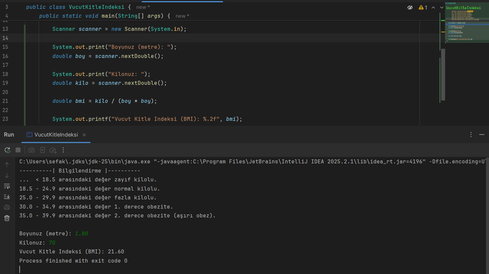
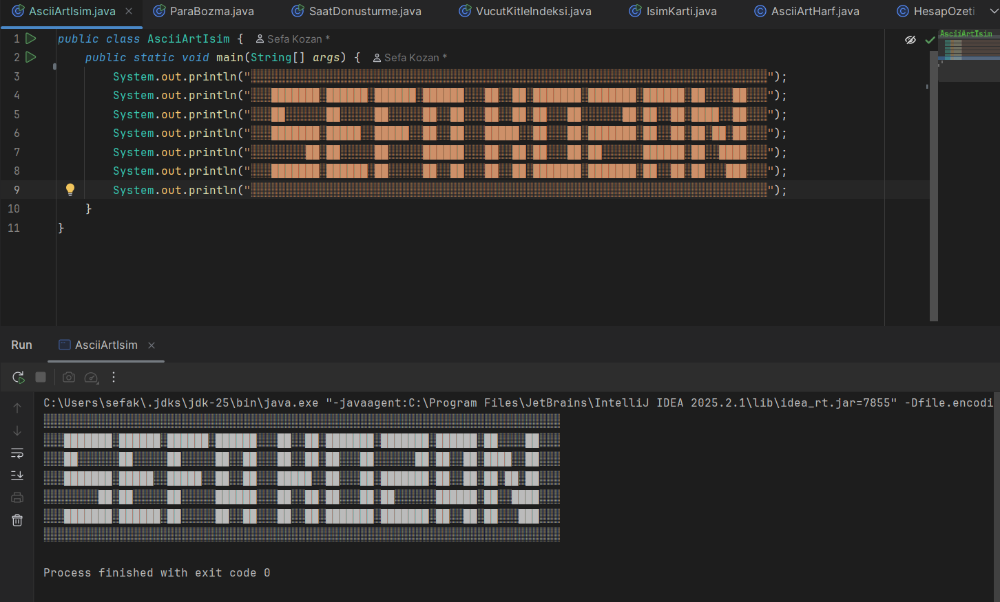
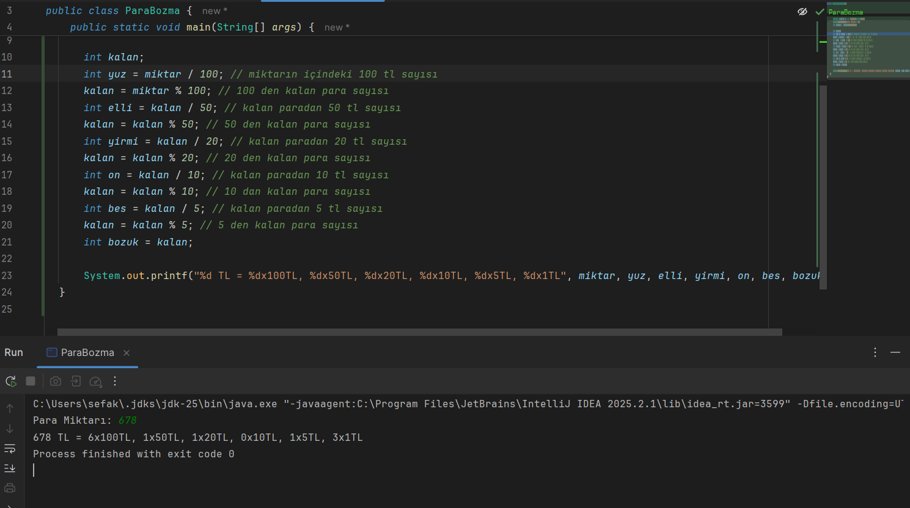
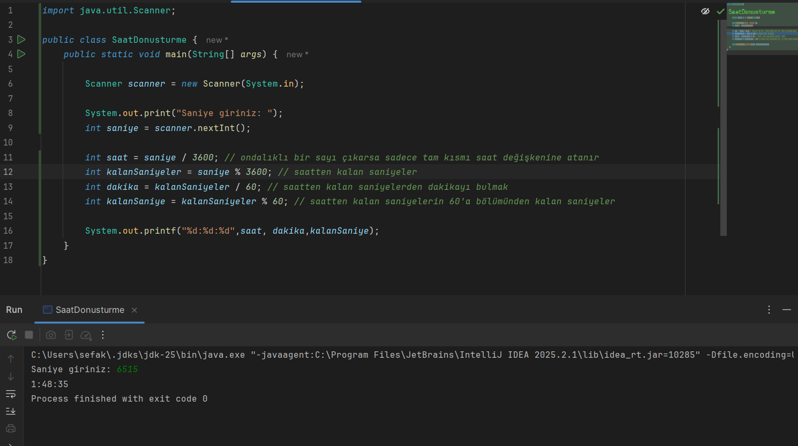

### Ad-Soyad: Muhammet Sefa KOZAN
### No: 250541057

```Not``` Program çıktıları (.class) **out** klasörü içerisinde yer almaktadır.

### Açıklama
- Vücut Kitle İndeksi projesinde Scanner kütüphanesi ile kullanıcıdan bilgiler alınarak indeks hesaplandı.
- Para Bozma projesinde int değişken türü için / (bölme) operatörünün sonuç olarak çıkan ondalıklı sayının tam kısmını yazdırma ve % (mod, kalan) operatörünün mantığı öğrenildi.
- Saat Dönüştürme projesinde / (bölme) ve % (mod, kalan) operatörlerinin mantığı öğrenildi. Scanner kütüphanesi ile kullanıcıdan saniye bilgisi alındı.

### Vücut Kitle İndeksi


### ASCII Art İsim


### Para Bozma


### Saat Dönüştürme


