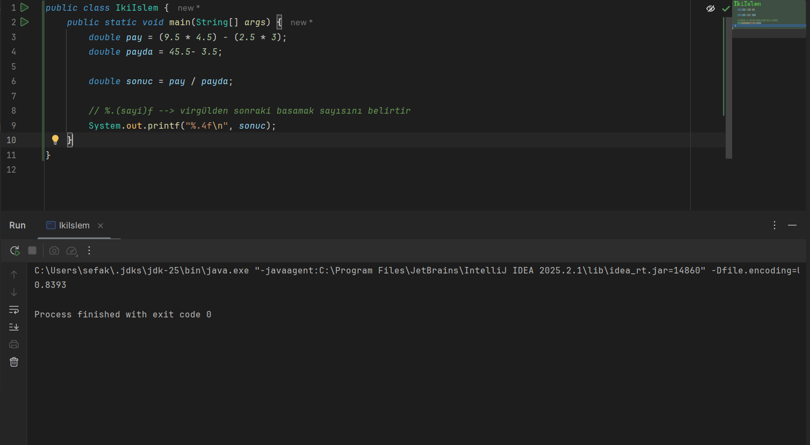
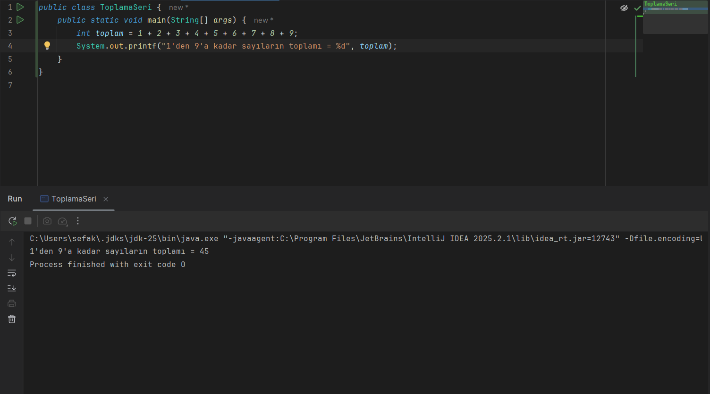
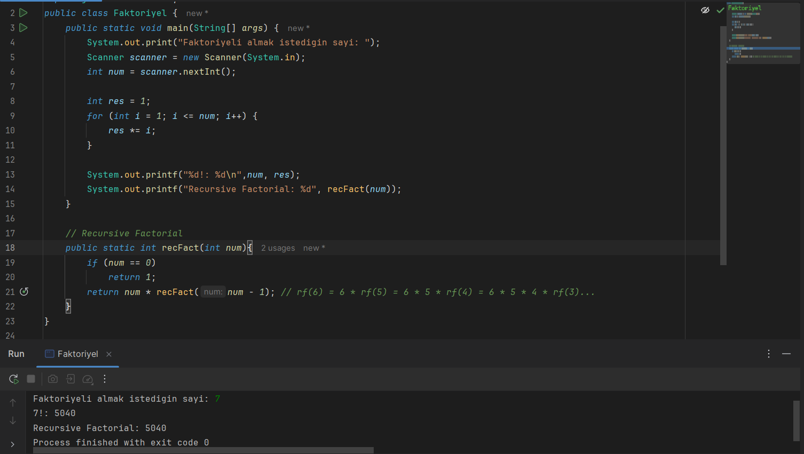

### Ad-Soyad: Muhammet Sefa KOZAN
### No: 250541057

```Not``` Program çıktıları (.class) **out** klasörü içerisinde yer almaktadır.

### Açıklama
- Faktoriyel projesinde, faktoriyel işlemi for döngüsü ve recursive fonksiyon olarak iki farklı şekilde yapıldı. Kullanıcıdan veri almak için Scanner kütüphanesi kullanıldı.

### İki İşlem


### Toplama Seri


### Faktoriyel



