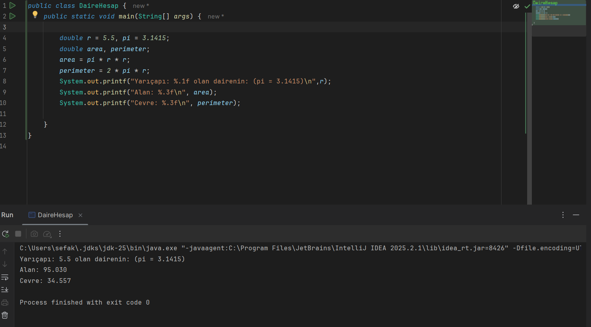
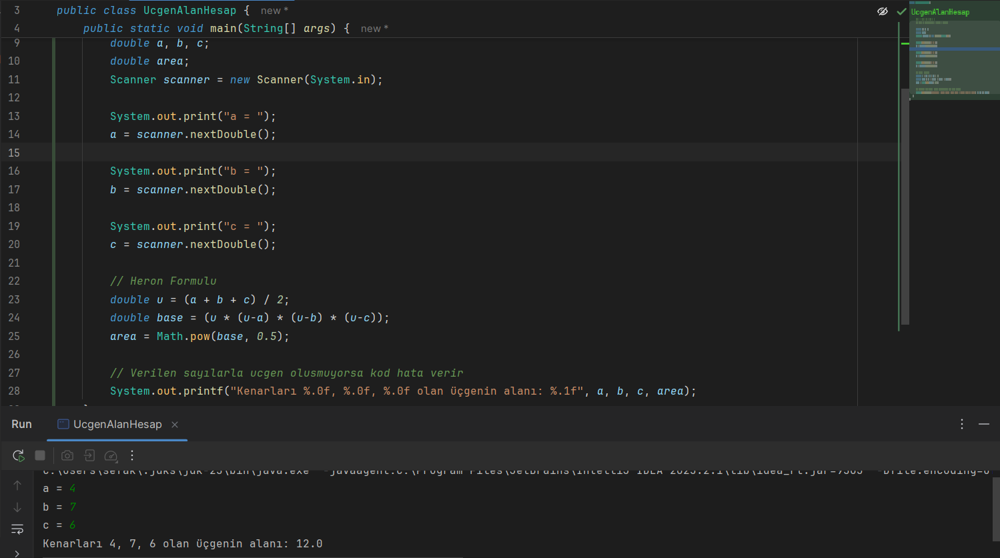

```Not``` Program çıktıları (.class) **out** klasörü içerisinde yer almaktadır.

### Açıklama
Double değişken türü üzerinden kodlar yazıldı. Ekstra olarak Üçgen Alan Hesap projesinde Scanner kütüphanesi ile kullanıcıdan üçgenin kenarları bilgisi alınarak heron formülü sayesinde üçgenin alanı hesaplandı.

### Daire Hesap


### Dikdörtgen Hesap


### Üçgen Alan Hesap
