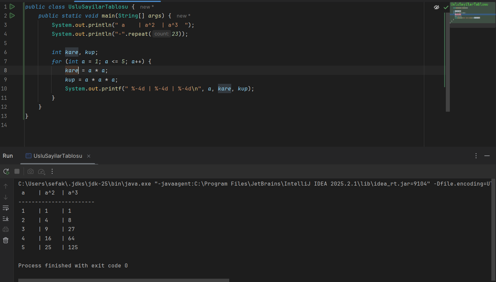
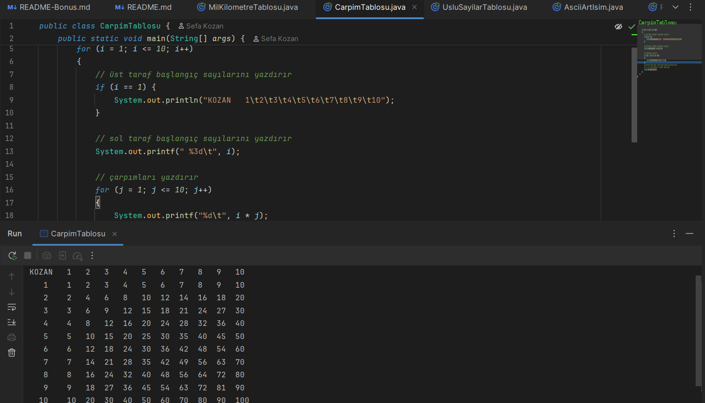

```Not``` Program çıktıları (.class) **out** klasörü içerisinde yer almaktadır.

### Açıklama
Bu projede ekstra kodlar kullanıldı.
- Üslü Sayılar Tablosu oluşturulurken for döngüsü kullanıldı.
- Mil-Kilometre Tablosu oluşturulurken for döngüsünün benzeri olan foreach döngüsü kullanıldı.
- Çarpım Tablosu oluşturulurken iç-içe for döngüsü kullanılarak 1'den 10'a kadar sayıların çarpımlarının tablosu oluşturuldu. Tablonun kenarları hangi sayıların çarpımının olduğunu gösteren sayı dizisi sırası eklendi.

### Üslü Sayılar Tablosu


### Mil-Kilometre Tablosu


### Çarpım Tablosu

